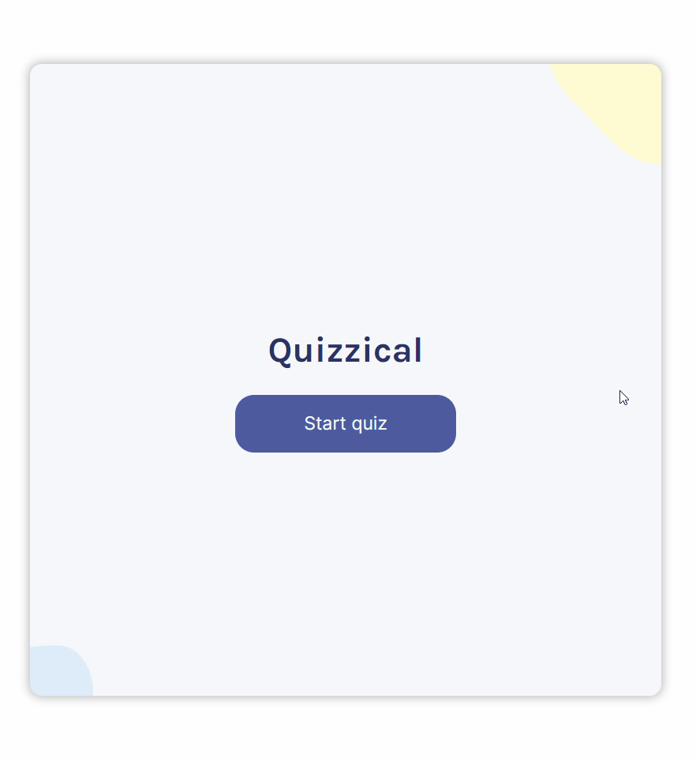
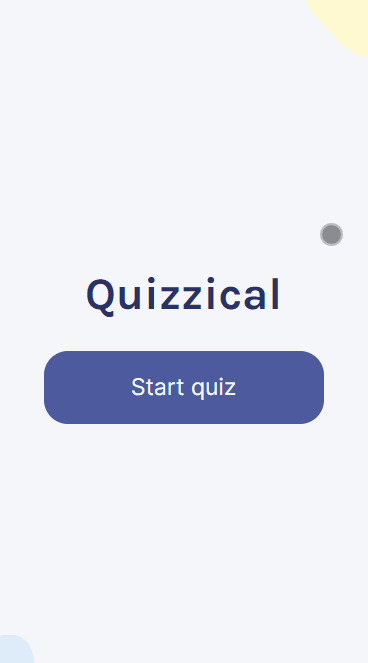
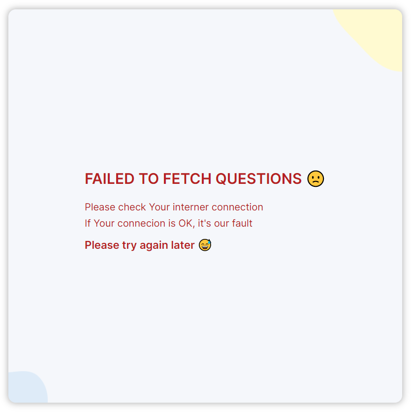

# Marcin Augun - Quizzical

[](https://marcin10lw.github.io/quizzical-react/)

## Description

Welcome to Quizzical! This project is a quiz site where you can test your general knowledge. It was developed as part of the Scrimba React Course with Bob Ziroll. It has been a great learning experience!

## Live Site URL [marcin10lw.github.io/quizzical-react](https://marcin10lw.github.io/quizzical-react/)

# 💻 Project Tech Stack:


## Features
In addition to the main functionality, I have implemented the following features independently:
- Redux Toolkit for state management
- Redux Saga for handling asynchronous actions
- Mobile design for a responsive experience

I have also added features based on the response status:

- Error handling
- Loading page

## Page preview



## Mobile preview



## Error preview



## Getting Started

To run this project locally, follow these steps:

1. Clone the repository to your local machine using the following command:

```bash
git clone https://github.com/marcin10lw/quizzical-react
```

2. Navigate to the project directory:

```bash
cd quizzical-react
```

3. Install the project dependencies using npm or yarn:

```bash
npm install
```

or

```bash
yarn install
```

4. Start the development server:

```bash
npm start
```

or

```bash
yarn start
```

5. Open your browser and visit http://localhost:3000 to view the website.
